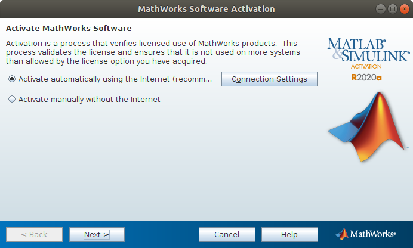
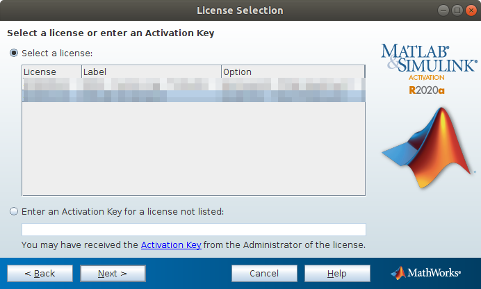
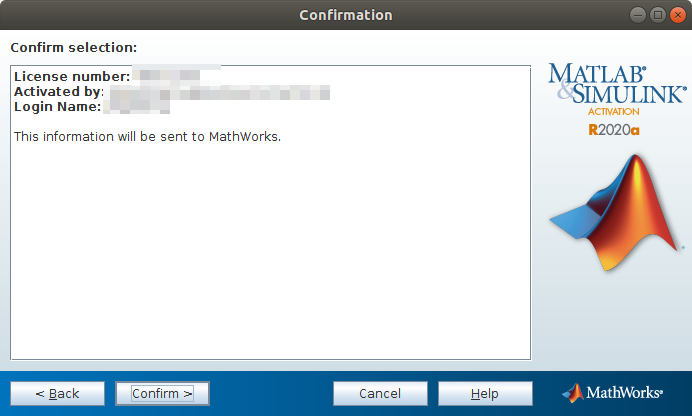

# How to install Matlab R2020a on Ubuntu 18.04 #

### 1. Goto Mathworks and Download the new .zip file ###

https://www.mathworks.com/downloads/

 *** If you have an account, you will directly goto the download page. Pleas select the Distribution for Linux.
 


### 2. Open a terminal and Goto the home folder and unzip the .zip file ###

``` 
  $ mkdir Mathworks_R2020a
  $ cd Mathworks_R2020a/
  ~/Mathworks_R2020a$ unzip matlab_R2020a_glnxa64.zip
``` 

### 3. After unzip, you should input the follow command in this folder ###

``` 
  ~/Mathworks_R2020a$sudo ./install
``` 

### 4. Input the user name and password and Always click Next ###

***You will see this selection"Create symbolic links to MATLAB scripts in:/usr/local/bin" during the installation.
   Select this and You can after that using this command "matlab" to run Matlab on your terminal.
   
 ### 5. Finish for the Installation ###
 
# How to activate Matlab R2020a on Ubuntu 18.04 #

### 6. Open a terminal and Goto the local folder of Matlab on your computer ###


``` 
  $ cd /usr/local/MATLAB/R2020a/bin/
  /usr/local/MATLAB/R2020a/bin/$ ./activate_matlab.sh
``` 

### 7. Activate Matlab R2020a on your computer ###

+++ 7.1 Select "Activate automatically using the Internet and Next"



+++ 7.2 Log in to your Mathworks Account


+++ 7.3 Select your current license



+++ 7.4 Input your Login Name


+++ 7.5 Finish



### 8. Open a terminal and run Matlab on your computer

``` 
  $ matlab
```

 
